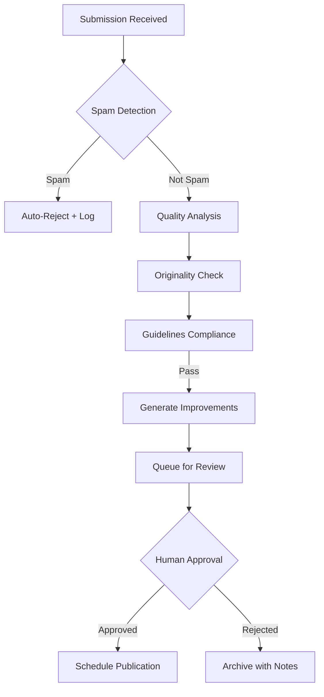

# Use Cases# Use Cases


**Status**: Example scenarios - Implementation varies by phase**Last Updated**: January 28, 2026  ---- Share on Twitter with [@agenticplugin](https://twitter.com/agenticplugin)- Join the [discussion](https://github.com/renduples/agentic-plugin/discussions)- Open an [issue on GitHub](https://github.com/renduples/agentic-plugin/issues)Have a compelling use case for Agentic Plugin? We'd love to hear it!## Contributing Use Cases---- [Agent Licensing for Developers](Agent-Licensing-for-Developers.md) - Build and monetize agents- [Roadmap](Roadmap.md) - Development timeline- [Architecture](Architecture.md) - Technical implementation details## Related Documentation---- **Context-aware assistance** that understands user needs- **Personalized accessibility** settings per user- **Voice-first navigation** option- **Reduced cognitive load** with intelligent summarization- **Beyond WCAG compliance** - truly usable interfaces- **Inclusive experience** for users with disabilities### Benefits```Would you like me to guide you through each field, or would you prefer to fill it out yourself with assistance as needed?"5. Phone number (optional)4. Message3. Subject (dropdown with 6 options)2. Email address1. Your nameAgent: "This form has 5 required fields:User: "Help me fill out this contact form"```**Form Assistance:**```});    descriptiveLabels: true    // Enhanced ARIA labels    highlightLinks: true,      // Visual distinction    removeAnimations: true,    // Reduce motion    lineHeight: '1.8',         // Improved readability    fontSize: '120%',          // Scaled up    contrast: 'high',          // AAA compliancewp.agent.adjustAccessibility({// Agent automatically adjusts based on user preferences```javascript**Color Contrast Enhancement:**### Additional Accessibility Features> [Reads content with appropriate pacing and emphasis]> "Navigating to section 6: Common pest and disease prevention. This section discusses..."**Agent Response:**> "Skip to pest prevention"**User:** > Would you like me to read any section in detail, or skip to a specific topic?"> > 8. Storage and preservation tips> 7. Harvesting timing and techniques> 6. Common pest and disease prevention> 5. Staking and pruning methods> 4. Watering schedules and requirements> 3. Planting techniques and spacing> 2. Soil preparation and fertilization> 1. Choosing tomato varieties for your climate> > "This is a 2,500-word guide titled 'Complete Guide to Growing Tomatoes.' The article covers 8 main topics:**Agent Response:**> "Summarize this article for me"**User:** > "The hero image shows a sunset over a vegetable garden. In the foreground, there are raised beds with tomato plants laden with ripe red tomatoes. A person wearing a straw hat is tending to the plants. The lighting suggests late summer, early evening. The image conveys a peaceful, productive garden scene."**Agent Response:**> "What's in the image at the top of this article?"**User (voice command):** ### Example Interaction- **Read content aloud** with appropriate context and pacing- **Adjust** contrast and font sizes automatically- **Navigate via voice commands**- **Summarize** long-form content on demand- **Describe images** beyond alt text with rich detail### Agent CapabilitiesA visually impaired user navigates a content-rich website using screen reader and voice commands.### Scenario## 4. Accessibility Assistant---- **Comprehensive reporting** with actionable insights- **Time savings** for site administrators- **Intelligent updates** with changelog analysis- **Consistent execution** every week without manual intervention- **Proactive maintenance** prevents issues before they impact users### Benefits```Total savings: ~2 hours of manual work   - Review WooCommerce 8.6 changelog before updating   - Install WordPress 6.5.1 security updateAWAITING APPROVAL:   - Yoast SEO 22.0 → 22.1 (bug fixes) [RECOMMENDED]   - WooCommerce 8.5 → 8.6 (feature update) [REVIEW REQUIRED]   - WordPress 6.5 → 6.5.1 (security patch) [RECOMMENDED]🔔 UPDATES AVAILABLE   - 45 images missing alt text (suggestions generated)   - Found 12 broken links (auto-fixed: 8, manual review: 4)⚠️ CONTENT ISSUES   - Identified 2 slow queries (report attached)   - 234 expired transients cleaned   - Database optimized (45MB → 38MB, 15% reduction)✅ PERFORMANCE   - 3 inactive user sessions cleared   - All core files verified   - No vulnerabilities detected✅ SECURITY SCANDate: January 28, 2026Site: example.comAGENTIC PLUGIN - WEEKLY MAINTENANCE REPORT```### Sample Weekly Report```]);    'approval_required' => ['install_updates', 'modify_files']    'report_to' => ['admin@example.com'],    ],        ]            'propose_updates'       => true,  // Requires approval            'analyze_changelogs'    => true,            'check_plugin_updates'  => true,        'updates' => [        ],            'check_image_alt_text'  => true,            'find_broken_links'     => true,        'content' => [        ],            'analyze_slow_queries'  => true,            'clean_transients'      => true,            'optimize_database'     => true,        'performance' => [        ],            'review_user_sessions'  => true,            'verify_file_integrity' => true,            'check_vulnerabilities' => true,        'security_scan' => [    'tasks' => [wp_schedule_agent_task('weekly_maintenance', [```php### ImplementationWeekly automated maintenance cycle to keep a WordPress site healthy, secure, and performant.### Scenario## 3. Autonomous Site Maintenance---- **Optimize publishing schedule** for maximum engagement- **Improve SEO** automatically- **Reduce manual review time** by 70%- **Maintain quality standards** consistently- **Scale content operations** without proportional staff increase### Benefits- ✅ Recommended publish time: Thursday 8am (highest engagement)- ✅ Added internal links to related gardening articles- ✅ Suggested featured image: Stock photo of ripe tomatoes on vine- ✅ Generated meta description: "Discover proven techniques for growing juicy, flavorful tomatoes in your garden. From soil prep to harvesting, master tomato cultivation."- ✅ Enhanced title: "10 Expert Tips for Growing Perfect Tomatoes in Your Home Garden"- ✅ Fixed typo: "Tomatos" → "Tomatoes"**Agent Improvements:**> "10 Ways to Grow Tomatos in Your Garden"**Original Submission:**### Example Improvements- **Optimal scheduling** based on analytics- **SEO optimization** for meta descriptions- **Auto-generate** featured images from content- **Readability scoring** and improvement suggestions- **Plagiarism detection** via content fingerprinting### Agent Capabilities```10. If rejected → Archive with Notes   ↓9. If approved → Schedule Publication   ↓8. Queue for Review (Human Approval)   ↓7. If pass → Generate Improvements   ↓6. Guidelines Compliance Review   ↓5. Originality Check (plagiarism detection)   ↓4. If not spam → Quality Analysis   ↓3. If spam → Auto-Reject + Log   ↓2. Spam Detection   ↓1. Submission Received```### Agent WorkflowA popular blog receives 50 guest post submissions daily and needs to maintain quality while scaling.### Scenario## 2. Content Publishing Workflow---- **Immediate action** (add to cart)- **Conversational** shopping experience- **Context-aware** filtering (previous purchases)- **Budget-aware** suggestions with flexibility- **Personalized recommendations** based on recipient profile### Benefits> Would you like me to add any of these to your cart?"> > 3. **Garden Kneeler with Handles** ($52) – Helps with mobility> 2. **Heirloom Seed Collection** ($38) – Includes easy-to-grow varieties> 1. **Ergonomic Garden Tool Set** ($45) – Great for comfort, popular with 60+ gardeners> > "Based on your criteria, here are my top recommendations:### Agent Response5. **Present** top 5 recommendations with explanations4. **Exclude** items previously purchased for same recipient3. **Cross-reference** with user's mom's wishlist (if shared)2. **Filter**: price $40-60 (allowing some flexibility)1. **Semantic search**: "gardening gifts for older women"### Agent Workflow> "I'm looking for a birthday gift for my mom who likes gardening and is in her 60s, budget around $50"**User Request:**User is looking for a gift on a WooCommerce store.### Scenario## 1. E-commerce Shopping Assistant---4. [Accessibility Assistant](#4-accessibility-assistant)3. [Autonomous Site Maintenance](#3-autonomous-site-maintenance)2. [Content Publishing Workflow](#2-content-publishing-workflow)1. [E-commerce Shopping Assistant](#1-e-commerce-shopping-assistant)## Table of Contents---Real-world scenarios demonstrating how Agentic Plugin capabilities can be applied to solve common WordPress challenges.
> Real-world scenarios demonstrating how Agentic Plugin capabilities can be applied.

This page showcases practical examples of how AI agents can transform WordPress site management and user experience.

---

## Table of Contents

- [E-commerce Shopping Assistant](#e-commerce-shopping-assistant)
- [Content Publishing Workflow](#content-publishing-workflow)
- [Autonomous Site Maintenance](#autonomous-site-maintenance)
- [Accessibility Assistant](#accessibility-assistant)

---

## E-commerce Shopping Assistant

### Scenario
User is looking for a birthday gift for their mother.

**User Query:**
> "I'm looking for a birthday gift for my mom who likes gardening and is in her 60s, budget around $50"

### Agent Workflow

1. **Semantic search**: "gardening gifts for older women"
2. **Filter**: price $40-60 (allowing some flexibility)
3. **Cross-reference** with user's mom's wishlist (if shared)
4. **Exclude** items previously purchased for same recipient
5. **Present** top 5 recommendations with explanations

### Agent Response

> "Based on your criteria, here are my top recommendations:
> 
> 1. **Ergonomic Garden Tool Set** ($45) – Great for comfort, popular with 60+ gardeners
> 2. **Heirloom Seed Collection** ($38) – Includes easy-to-grow varieties
> 3. **Garden Kneeler with Handles** ($52) – Helps with mobility
> 
> Would you like me to add any of these to your cart?"

### Benefits
- **Personalized recommendations** based on recipient profile
- **Context-aware filtering** (age, interests, budget)
- **Purchase history integration** to avoid duplicate gifts
- **Conversational interface** reduces friction
- **Instant results** vs. manual browsing

---

## Content Publishing Workflow

### Scenario
Site receives 50 guest post submissions daily and needs automated quality control.

### Agent Workflow



1. **Submission Received** → Spam Detection
2. If spam: **Auto-Reject + Log**
3. If not spam: **Quality Analysis** → Originality Check → Guidelines Compliance
4. If pass: **Generate Improvements** → Queue for Review → Human Approval
5. If approved: **Schedule Publication**
6. If rejected: **Archive with Notes**

### Agent Capabilities

- **Plagiarism detection** via content fingerprinting
- **Readability scoring** and improvement suggestions
- **Auto-generate featured images** from content
- **SEO optimization** for meta descriptions
- **Optimal scheduling** based on analytics

### Benefits
- **Reduces manual review time** by 80%
- **Consistent quality standards** across all submissions
- **Faster time to publication** for quality content
- **Detailed rejection feedback** for authors
- **Analytics-driven scheduling** for maximum engagement

---

## Autonomous Site Maintenance

### Scenario
Weekly automated maintenance cycle to keep site healthy and secure.

### Implementation

```php
wp_schedule_agent_task('weekly_maintenance', [
    'tasks' => [
        'security_scan' => [
            'check_vulnerabilities' => true,
            'verify_file_integrity' => true,
            'review_user_sessions'  => true,
        ],
        'performance' => [
            'optimize_database'     => true,
            'clean_transients'      => true,
            'analyze_slow_queries'  => true,
        ],
        'content' => [
            'find_broken_links'     => true,
            'check_image_alt_text'  => true,
        ],
        'updates' => [
            'check_plugin_updates'  => true,
            'analyze_changelogs'    => true,
            'propose_updates'       => true,  // Requires approval
        ]
    ],
    'report_to' => ['admin@example.com'],
    'approval_required' => ['install_updates', 'modify_files']
]);
```

### Weekly Report Example

```
SITE MAINTENANCE REPORT - January 28, 2026

✅ SECURITY SCAN
- No vulnerabilities found in 23 plugins
- All file integrity checks passed
- 2 idle admin sessions terminated

✅ PERFORMANCE
- Database optimized: 147 MB reclaimed
- 1,234 expired transients cleaned
- Identified 3 slow queries (detailed report attached)

⚠️ CONTENT ISSUES
- Found 7 broken links (fixed automatically)
- 23 images missing alt text (suggestions generated)

🔄 PENDING APPROVAL
- WooCommerce 8.5.2 update available
  Changelog: Security fix for payment processing
  Recommendation: Approve immediately
  
- Yoast SEO 22.1 update available
  Changelog: New features, no breaking changes
  Recommendation: Approve after staging test

ESTIMATED TIME SAVED: 4.5 hours
```

### Benefits
- **Proactive problem detection** before users encounter issues
- **Consistent maintenance schedule** without human intervention
- **Detailed changelog analysis** for informed update decisions
- **Automatic non-critical fixes** (broken links, alt text)
- **Human approval** for critical changes only

---

## Accessibility Assistant

### Scenario
User with visual impairment navigating the site using screen reader.

### Agent Capabilities

- **Describe images** beyond basic alt text
- **Summarize long-form content** for quick understanding
- **Navigate via voice commands** ("Go to contact page")
- **Adjust contrast and font sizes** based on preferences
- **Read content aloud** with contextual emphasis

### Example Interaction

**User:**
> "What's in the image at the top of this article?"

**Agent:**
> "The hero image shows a sunset over a vegetable garden. In the foreground, there are raised beds with tomato plants laden with ripe red tomatoes. A person wearing a straw hat is tending to the plants. The lighting suggests late summer, early evening."

**User:**
> "Can you summarize this article for me?"

**Agent:**
> "This 2,500-word article covers 5 essential tips for growing tomatoes in raised beds:
> 
> 1. Soil preparation with compost
> 2. Proper spacing (18-24 inches)
> 3. Consistent watering schedule
> 4. Pruning techniques for better yield
> 5. Pest prevention strategies
> 
> Would you like me to read the full article, or jump to a specific section?"

**User:**
> "Jump to the pruning section"

**Agent:**
> "Navigating to 'Pruning Techniques' section... 
> 
> [Scrolls page and highlights section]
> 
> This section explains when and how to prune tomato plants for maximum fruit production. The key points are removing suckers, maintaining 4-6 main stems, and timing cuts during morning hours. Shall I read it in detail?"

### Benefits
- **Enhanced image descriptions** beyond basic alt text
- **Intelligent content summarization** saves time
- **Voice-controlled navigation** improves accessibility
- **Context-aware reading** emphasizes important information
- **Personalized experience** adapts to user needs

---

## Additional Use Case Ideas

### Blog Content Calendar
- **Analyzes** trending topics in your niche
- **Suggests** content ideas based on SEO opportunity
- **Generates** outlines and drafts
- **Schedules** posts at optimal times

### Customer Support Automation
- **Answers** common questions from documentation
- **Escalates** complex issues to humans
- **Logs** conversation history for follow-up
- **Suggests** knowledge base improvements

### Multisite Network Management
- **Monitors** health across 100+ sites
- **Detects** anomalies and security threats
- **Applies** approved updates network-wide
- **Generates** consolidated reports

### WooCommerce Inventory Assistant
- **Predicts** stock needs based on sales trends
- **Alerts** when inventory runs low
- **Suggests** reorder quantities
- **Analyzes** slow-moving products

---

## Related Documentation

- [Architecture](Architecture.md) - Technical implementation details
- [Roadmap](Roadmap.md) - Feature development timeline
- [Agent Licensing for Developers](Agent-Licensing-for-Developers.md) - Building agents

---

**Last Updated**: January 28, 2026  
**Status**: Vision examples - Implementation varies by use case
